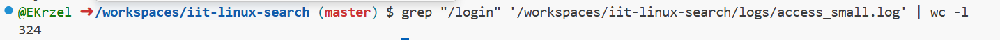
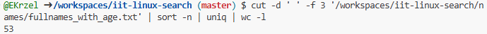
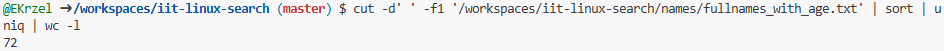
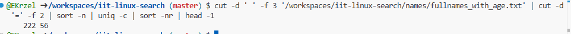
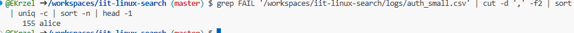
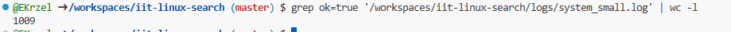
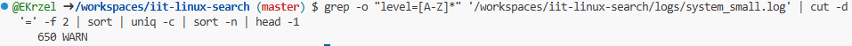
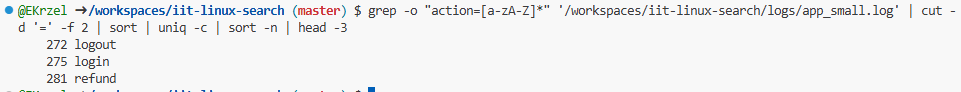
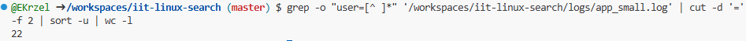

> This is the demonstration how to use Linux commands to process strutured text data.

### 0. How many lines are in fullnames_with_age.txt?

Put screenshot from Codespaces illustrating the result here.
Correct screenshot should contain your github username in the shell, a command and the result.

Example:

**Explanation** Write the explanation why the specific command was used.

Example: wc command is to count data in a given file. -l parameter is for counting lines.

### 1. How many lines in access_small.log have path /login?

Put screenshot from Codespaces illustrating the result here.
Correct screenshot should contain your github username in the shell, a command and the result.

**Explanation** Write the explanation why the specific command was used.
grep collects only the lines with /login wc counts data -l counts lines.

---

### 2. How many different ages are in fullnames_with_age.txt?

Put screenshot from Codespaces illustrating the result here.
Correct screenshot should contain your github username in the shell, a command and the result.

**Explanation** Write the explanation why the specific command was used.
cut -d ' ' -f 3 cuts unnessesary data to sort it. sort - n sorts it numericaly in order for uniq to work. uniq | wc -l finds uniq numbers and counts the lines with them.

---

### 3. How many unique first names are in fullnames_with_age.txt?

Put screenshot from Codespaces illustrating the result here.
Correct screenshot should contain your github username in the shell, a command and the result.

**Explanation** Write the explanation why the specific command was used.

cut -d ' ' -f1 cuts only firstnames.  sort - n sorts it numerically in order for uniq to work. uniq | wc -l finds uniq numbers and counts the lines with them.

---

### 4. Which age is most frequent in fullnames_with_age.txt?

Put screenshot from Codespaces illustrating the result here.
Correct screenshot should contain your github username in the shell, a command and the result.

**Explanation** Write the explanation why the specific command was used.

cut -d ' ' -f 3 ....txt | cut -d '=' -f 2  cuts unnessesary data to sort it. sort -n sorts it numerically. uniq -c counts occurrences of specific ages and sort -nr sorts it to make sure that the most frequent number is on the top. head -1 prints only 1st line.

---

### 5. Which username failed login most often in auth_small.csv?

Put screenshot from Codespaces illustrating the result here.
Correct screenshot should contain your github username in the shell, a command and the result.

**Explanation** Write the explanation why the specific command was used.

grep collects only the lines with FAIL. cut -d ',' -f2 | sort sorts it. uniq -c | sort -n | head -1 counts the ocurrences then sorts it and prints only the first line.

---

### 6. How many lines in system_small.log have ok=true?

Put screenshot from Codespaces illustrating the result here.
Correct screenshot should contain your github username in the shell, a command and the result.

**Explanation** Write the explanation why the specific command was used.

grep finds only lines with ok=true. wc -l counts it.

---

### 7, Which level (INFO, WARN, ERROR) appears most often in system_small.log?

Put screenshot from Codespaces illustrating the result here.
Correct screenshot should contain your github username in the shell, a command and the result.

**Explanation** Write the explanation why the specific command was used.
grep -o collects only level=INFO, level=WARN, level=ERROR. cut cuts unnessesary data, sorts sorts it, uniq -c counts ocurrances. sort -n sorts it numerically. head -l prints only first line.

---

### 8. What is the top 3 most common actions in app_small.log?

Put screenshot from Codespaces illustrating the result here.
Correct screenshot should contain your github username in the shell, a command and the result.

**Explanation** Write the explanation why the specific command was used.
grep -o collected only action=... . cut cuts unnessesary data, sorts sorts it, uniq -c counts ocurrances. sort -n sorts it numerically. head -3 prints 3 first lines.

---

### 9. How many unique users are in app_small.log?

Put screenshot from Codespaces illustrating the result here.
Correct screenshot should contain your github username in the shell, a command and the result.

**Explanation** Write the explanation why the specific command was used.
grep -o collected only user=... .cut -d '=' -f 2 cuts unnessesary data. sort -u sorts and removes duplicates. wc -l counts lines.

---